# Conference

A multi-tenant video conferencing SaaS built on [LiveKit](https://livekit.io/): authenticated meetings, a mobile app, AI-generated meeting notes, livestreaming, and recording — with a Next.js web app, a React Native mobile app, and a self-hosted LiveKit + Egress + MinIO backend.

## Screenshots

| | |
|---|---|
| 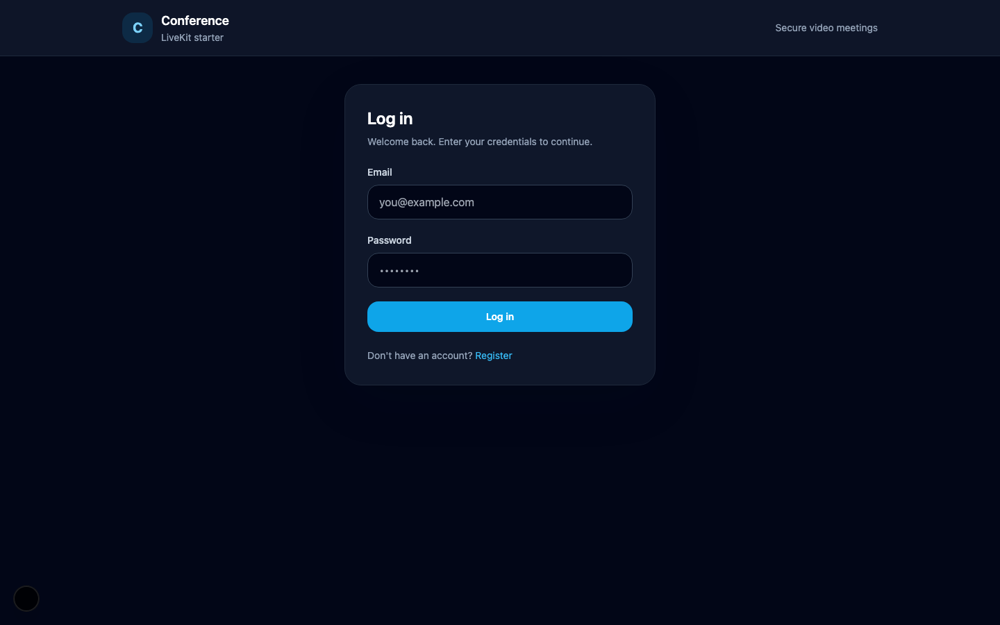 Login | 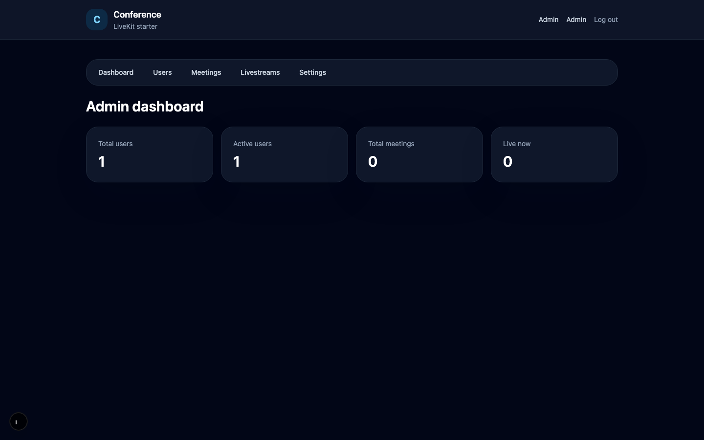 Admin dashboard |
| 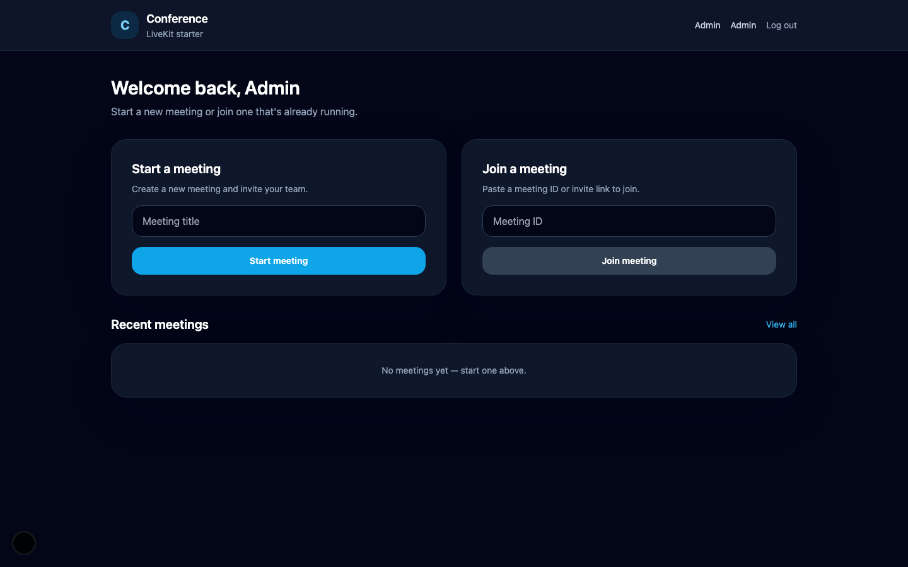 User dashboard | 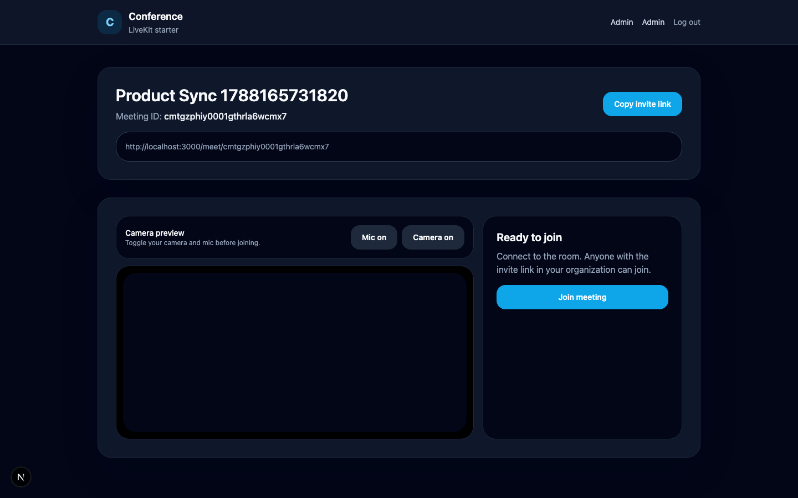 Camera preview before joining |
| 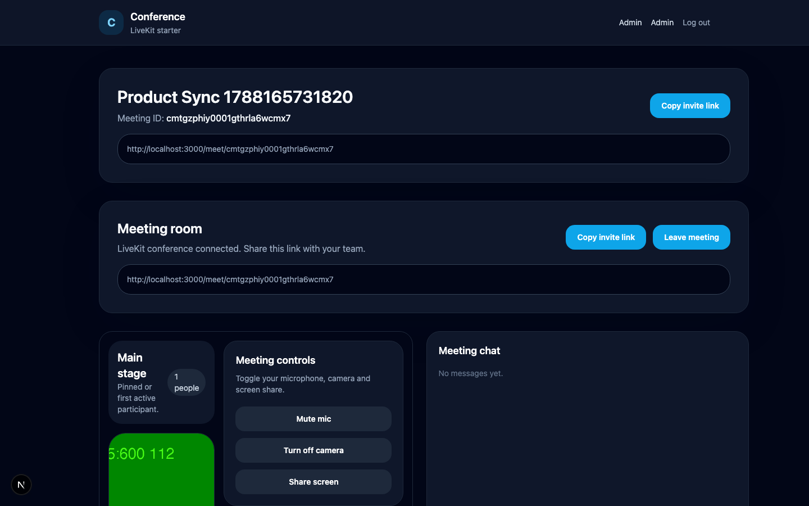 Live meeting room | 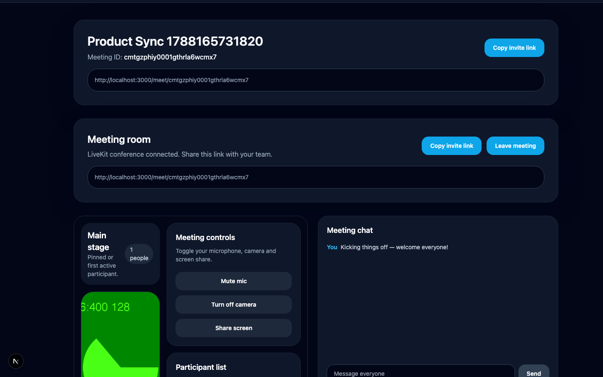 In-meeting chat |
| 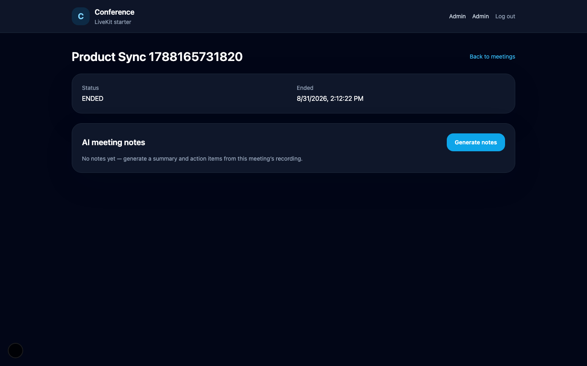 AI meeting notes | 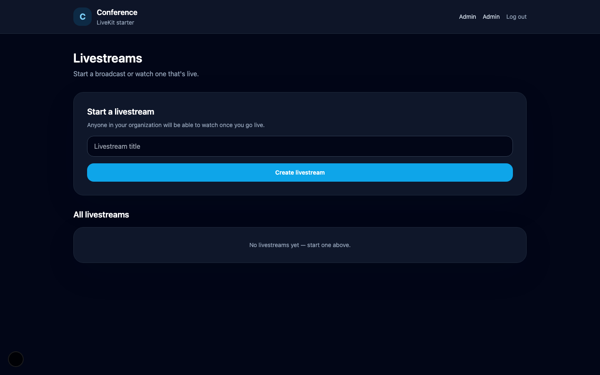 Livestreams |
| 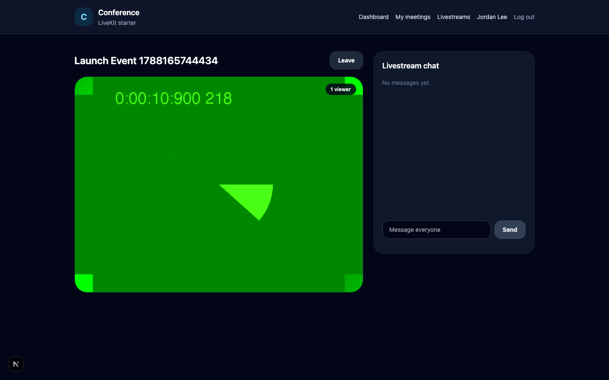 Watching a livestream | 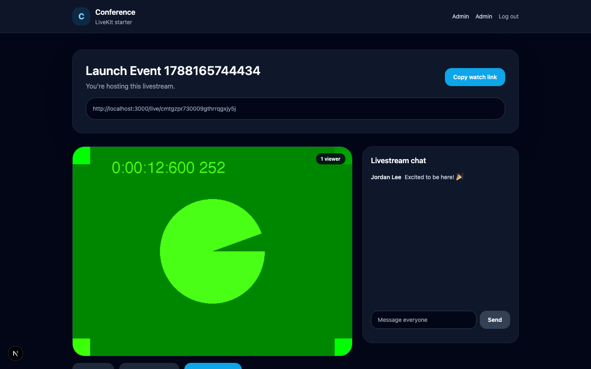 Hosting a livestream |
| 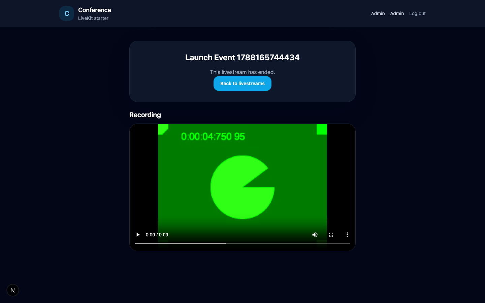 Recording playback | 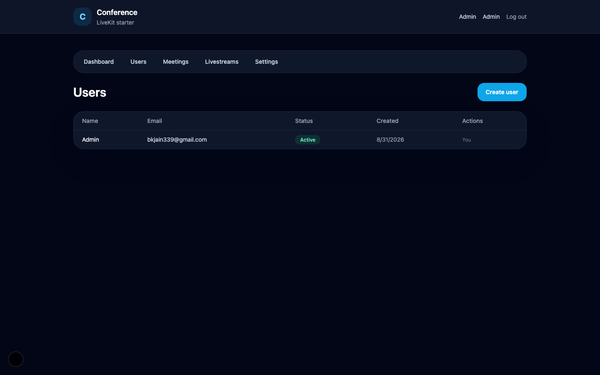 Admin: user management |

## Features

Built in phases, each adding a self-contained capability on top of the last:

- **Multi-tenant foundation** — organizations, session-based auth, roles (`ADMIN`/`USER`), admin console (user management, registration toggle, audit log)
- **Meetings** — create/join/leave, LiveKit video + audio, screen share, persisted + real-time chat, participant time tracking
- **Mobile app** (React Native / Expo) — auth, meeting list, and a full LiveKit meeting room (camera/mic publish, remote participant grid, chat)
- **AI meeting notes** — after a meeting ends, the host (or an admin) can request a transcript, summary, and action items, generated via OpenAI from the meeting's recorded audio
- **Livestreaming** — one host broadcasts, any number of org members watch, with live viewer count and chat; mobile can watch (not host)
- **Recording + playback** — livestreams are recorded (video) and become watchable afterward; meetings are recorded audio-only (see [Recording](#recording) below for why)

## Tech stack

| | |
|---|---|
| Web | Next.js 15 (App Router), React 18, Tailwind CSS |
| Database | PostgreSQL + Prisma |
| Realtime / media | [LiveKit](https://livekit.io/) (self-hosted): `livekit-server-sdk`, `livekit-client`, `@livekit/components-react` |
| Mobile | Expo (React Native), `@livekit/react-native` |
| AI | OpenAI (`gpt-4o-transcribe` for transcription, `gpt-4o` for structured note/action-item extraction) |
| Recording storage | S3-compatible object storage (self-hosted [MinIO](https://min.io/) in this deployment) |
| Auth | Session cookies, `bcryptjs` for password hashing |
| Validation | Zod |
| Testing | Vitest |

## Architecture

```
┌─────────────┐        ┌──────────────┐        ┌─────────────────┐
│  Next.js app │◄──────►│  PostgreSQL  │        │   Mobile (Expo)  │
│ (web client  │        │  (Prisma)    │        │  meeting + live- │
│  + API + SSR)│        └──────────────┘        │  stream viewer   │
└──────┬───────┘                                └────────┬─────────┘
       │  mints scoped LiveKit tokens                     │
       │  (host/publish vs. viewer/subscribe-only)        │
       ▼                                                  ▼
┌─────────────────────────── LiveKit server ───────────────────────────┐
│                (self-hosted, Docker, on a VPS)                       │
└───────────┬───────────────────────┬──────────────────────┬──────────┘
            │ Redis (LiveKit ⇄ Egress coordination)         │
            ▼                                               ▼
     ┌─────────────┐                                 ┌─────────────┐
     │   Redis     │                                 │ LiveKit      │
     └─────────────┘                                 │ Egress       │
                                                       │ (recording)  │
                                                       └──────┬───────┘
                                                              │ uploads
                                                              ▼
                                                       ┌─────────────┐
                                                       │   MinIO      │
                                                       │ (S3-compat.) │
                                                       └──────┬───────┘
                                                              │ fetched for
                                                              │ transcription /
                                                              │ served via
                                                              │ presigned URL
                                                              ▼
                                                       ┌─────────────┐
                                                       │   OpenAI     │
                                                       │ (transcribe  │
                                                       │  + summarize)│
                                                       └─────────────┘
```

The web app never talks to LiveKit's API key/secret from the client — it always mints a short-lived, scoped token server-side (host vs. viewer grants differ) and hands only that token to the browser/app.

## Recording

Meetings and livestreams are recorded differently, on purpose:

- **Livestreams** get full video + audio recording. A livestream only ever has one publisher (the host), so this uses LiveKit's **Track Composite Egress** — it records that one participant's camera + mic directly, without spinning up a browser to composite a layout.
- **Meetings** are recorded **audio-only**, feeding the AI notes pipeline. Meetings can have multiple participants, so a true "everyone on screen" recording needs **Room Composite Egress**, which renders a layout via headless Chrome. That requires meaningfully more CPU than Track Composite. On the reference deployment (a 2-vCPU VPS), Room Composite egress was tested and confirmed to fail — the request times out because no egress worker advertises enough capacity to accept it. Audio-only room composite egress avoids Chrome entirely and comfortably fits.

If you deploy this on a larger box (4+ vCPUs), Room Composite Egress for meetings becomes viable and `services/egress.service.ts` is the place to add it.

## Project structure

```
app/                    Next.js routes (pages + API routes)
components/             React components, grouped by feature (meeting, livestream, admin, auth, ui)
services/               Business logic + Prisma access (meeting, livestream, egress, meetingNotes, ...)
lib/                    Auth, validation, LiveKit token minting, S3/recording helpers
prisma/                 Schema + migrations
mobile/                 Expo / React Native app (independent project, own package.json)
docs/screenshots/       Screenshots used in this README
```

## Setup

### Prerequisites

- Node.js 20+ (some dependencies require it — see [Node version note](#node-version-note))
- PostgreSQL
- A LiveKit deployment (self-hosted or [LiveKit Cloud](https://livekit.io/cloud)) with Egress + Redis if you want recording/AI notes
- An S3-compatible bucket (AWS S3, MinIO, etc.) if you want recording/AI notes
- An OpenAI API key if you want AI notes

### Web app

```bash
npm install
cp .env.example .env   # fill in the values below
npx prisma migrate deploy
npx prisma db seed      # creates your organization + first admin account
npm run dev
```

Environment variables (`.env`):

| Variable | Purpose |
|---|---|
| `DATABASE_URL` | Postgres connection string |
| `NEXT_PUBLIC_LIVEKIT_WS_URL`, `LIVEKIT_WS_URL` | LiveKit server WebSocket URL |
| `LIVEKIT_API_KEY`, `LIVEKIT_API_SECRET` | Must match a key configured on your LiveKit server's `keys:` section |
| `OPENAI_API_KEY` | Required for AI meeting notes (transcription + summarization) |
| `RECORDING_S3_ENDPOINT`, `RECORDING_S3_REGION`, `RECORDING_S3_BUCKET`, `RECORDING_S3_ACCESS_KEY_ID`, `RECORDING_S3_SECRET_ACCESS_KEY` | Where recordings are uploaded by Egress and read back from — must match your Egress `storage.s3` config |
| `SEED_ORG_NAME`, `SEED_ORG_SLUG`, `SEED_ADMIN_NAME`, `SEED_ADMIN_EMAIL`, `SEED_ADMIN_PASSWORD` | Bootstrap organization + first admin (used only by `npx prisma db seed`) |

Public registration always creates `USER` accounts — creating an `ADMIN` account is only possible via the seed script.

### Mobile app

```bash
cd mobile
npm install
cp .env.example .env   # set EXPO_PUBLIC_API_BASE_URL to your web app's URL
npx expo prebuild       # generates ios/ and android/ — required, this app uses native LiveKit modules
npm run ios             # or: npm run android
```

The mobile app can't run in Expo Go — it depends on `@livekit/react-native`'s native module, which needs a native build (`expo prebuild` + `expo run:ios`/`run:android`).

### LiveKit backend (self-hosted)

This deployment runs LiveKit, Redis, MinIO, and LiveKit Egress together via Docker Compose on one VPS. A minimal `docker-compose.yml` for that shape:

```yaml
services:
  livekit:
    image: livekit/livekit-server:latest
    network_mode: host   # needs to bind directly to its RTC ports
    command: --config /livekit.yaml
    volumes: ["./livekit.yaml:/livekit.yaml"]
    depends_on: [redis]

  redis:
    image: redis:7-alpine
    ports: ["127.0.0.1:6379:6379"]
    volumes: ["./redis-data:/data"]

  minio:
    image: minio/minio:latest
    ports: ["0.0.0.0:9000:9000", "127.0.0.1:9001:9001"]   # 9000 must be reachable by your app; 9001 (console) can stay local
    volumes: ["./minio-data:/data"]
    env_file: ["./minio.env"]
    command: server /data --console-address ":9001"

  egress:
    image: livekit/egress:latest
    extra_hosts: ["host.docker.internal:host-gateway"]   # so it can reach the host-networked livekit service
    environment: ["EGRESS_CONFIG_FILE=/egress.yaml"]
    volumes: ["./egress.yaml:/egress.yaml"]
    depends_on: [livekit, redis, minio]
```

Key points if you're reproducing this:

- `livekit.yaml` needs a `redis:` block pointing at the `redis` service, and its `keys:` entry's name must be the exact string used as `LIVEKIT_API_KEY` in the app's `.env` (a mismatch here means every join request gets silently rejected).
- **Don't put Egress on `network_mode: host`** if the box runs other unrelated Docker services — Egress's WebRTC/ICE stack will try every virtual interface on the host, including ones belonging to other containers, and can fail to connect. Give it its own Docker network instead (as above) and reach LiveKit via `host.docker.internal`.
- Egress's config file (`egress.yaml`) needs to be world-readable (`chmod 644`) — the image's default user can't read a `600` file, which causes a silent crash-loop.
- If your box has limited CPU, prefer **Track Composite** or **audio-only Room Composite** egress over full (video) Room Composite — see [Recording](#recording).

### Node version note

Some dependencies (React Native tooling in `mobile/`, current Metro/eslint versions) require Node ≥ 20. If you're on an older Node via `nvm`:

```bash
nvm install node   # installs latest
nvm alias default node
```

## Testing

```bash
npm run typecheck   # root web app
npm test            # vitest — services, auth, validation
npm run lint

cd mobile && npm run typecheck   # mobile app (separate TS project)
```

## Known limitations

- Meeting video recording isn't available (see [Recording](#recording)) — only audio, used for AI notes.
- Mobile is viewer-only for livestreams and doesn't host meetings/livestreams; there's no mobile UI for AI notes.
- There's no admin oversight page for livestreams (meetings have one at `/admin/meetings`).
- Multi-organization self-service signup isn't implemented — this app is bootstrapped with a single organization via the seed script.
